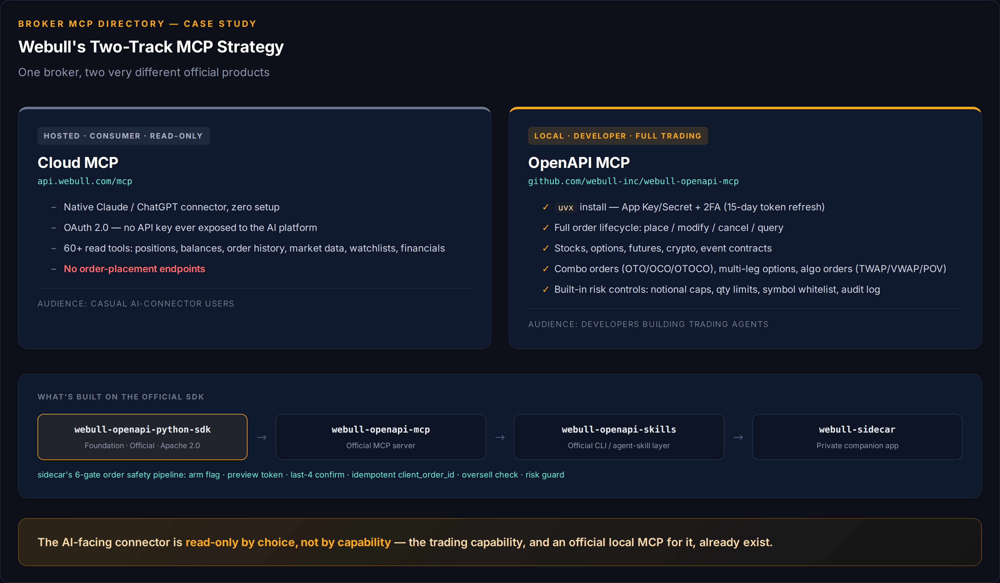
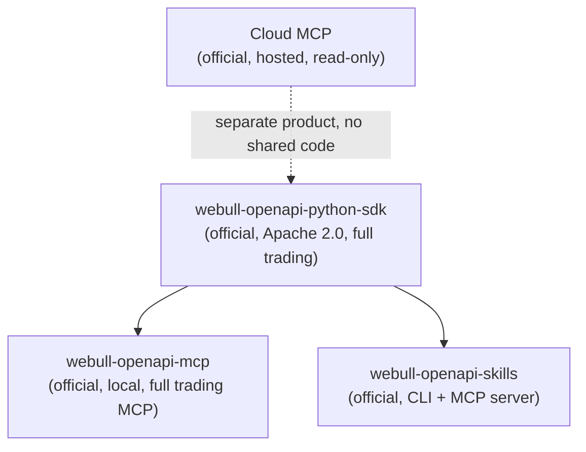

# Webull

Webull ships **two separate official MCP products**, aimed at different audiences.
Don't conflate them — they have opposite trading postures.



## 1. Cloud MCP — hosted, consumer, read-only

The AI-connector-marketplace product: native Claude/ChatGPT integration, zero local
setup.

Hosted endpoint: `https://api.webull.com/mcp`

| Platform | Setup |
|---|---|
| Claude | Native integration via Claude Connectors |
| ChatGPT | Native integration via ChatGPT Apps |
| Codex | `codex mcp add webull --url https://api.webull.com/mcp` |
| Cursor | Settings → MCP Servers → Add Remote MCP Server |
| Zed | `settings.json` under `context_servers` |

**Auth**: OAuth 2.0 authorization-code flow, mobile/email + password + trading
password on Webull's own authorization page. No API key exposed to the AI platform.

**Trading scope**: **read-only.** 60+ functions covering account/position/balance,
order history/status, market data, watchlists, analyst ratings, financials,
dividend/earnings calendars. No order-placement endpoints.

**Safety**: least-privilege — you choose which accounts and capability groups
(Account Info, Order Query, Market Data, Security Master) the agent can see.

Source: [developer.webull.com](https://developer.webull.com/apis/docs/AI-friendly-Resources/mcp/)

## 2. OpenAPI MCP — local, developer, full trading

`github.com/webull-inc/webull-openapi-mcp` — published under Webull's own verified
GitHub org, built on their official `webull-openapi-python-sdk`. This is the one
with actual order placement.

**Connect**:
```
uvx webull-openapi-mcp auth    # interactive 2FA, approve in the Webull mobile app
uvx webull-openapi-mcp serve
```
App Key + App Secret from a regional Webull developer portal (developer.webull.com
for US, region-specific portals otherwise), set via env vars or `.env`. Tokens
auto-refresh; re-auth needed only after the 15-day expiry.

**Trading scope — full order lifecycle**: place, modify (`replace_*_order`), cancel,
query. Stocks, options, futures, crypto, event contracts. Combo orders
(OTO/OCO/OTOCO, US only), multi-leg options (US only), algo orders — TWAP, VWAP, POV
(US only). Region-specific order types and session validation apply.

**Safety / guardrails**: **sandbox is the default.** `WEBULL_ENVIRONMENT` accepts `uat`
(sandbox) or `prod` and defaults to `uat`. The security section says so outright:
*"Default sandbox — The server defaults to UAT (sandbox) environment. You must
explicitly set `WEBULL_ENVIRONMENT=prod` for live trading."* Both official repos behave
this way. That puts Webull alongside [Alpaca](alpaca.md) and [Kraken](kraken.md) in the
small group that ships safe-by-default, and it's the kind of fact this directory should
lead with rather than omit.

Beyond that: notional limits by currency (`WEBULL_MAX_ORDER_NOTIONAL_USD` default
`10000`), max order quantity caps (`MAX_ORDER_QUANTITY` default `1000`), symbol
whitelist enforcement (`WEBULL_SYMBOL_WHITELIST`), and audit logging
(`WEBULL_AUDIT_LOG_FILE`) — all backed by `guards.py` / `audit.py` in the tree.

**Maintenance**: Apache 2.0, 12 stars, 23 commits, latest release v1.1.7 (2026-07-13) —
actively developed but modest in scope; a young project, not battle-tested at scale.

## 3. OpenAPI Skills — CLI **and** MCP server

`github.com/webull-inc/webull-openapi-skills` — also built on the official SDK, same
org. **It is dual-layer: a CLI *and* an MCP server.** Its README states plainly *"This
skill works as an MCP server"* and ships an `mcpServers` config using command
`webull-skill` with args `["mcp"]` for Claude Code and Codex.

CLI usage: `webull-skill auth`, `webull-skill trading --action account-list`, etc.
Multi-region, same asset-class and risk-control coverage as the MCP server — including
the same sandbox-by-default posture. 21 commits, actively developed.

> An earlier version of this page called this "a skill/CLI wrapper rather than an MCP
> server." That was wrong — it's both.

## How they relate



## Caveats

- If you want an AI agent trading through Claude's official connector marketplace
  today, you're stuck with Cloud MCP's read-only scope. Full trading requires the
  local `webull-openapi-mcp` (or the skills CLI), both of which are young/lower-star
  repos — spot-check current state before relying on them for real money.
- Watch for Webull eventually merging trading into Cloud MCP — the capability and an
  official local implementation both already exist, it's a product decision away.
