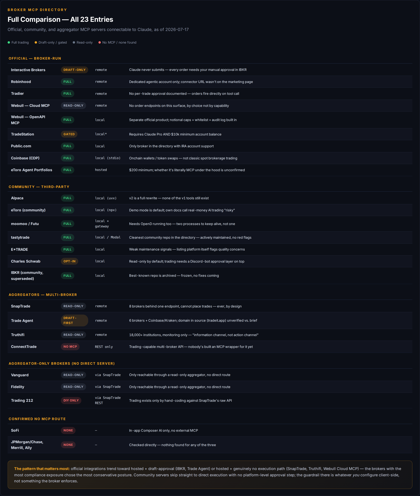

# Awesome Broker MCP 

> Which brokers can an AI actually trade through?

[MCP](https://modelcontextprotocol.io) is how an AI assistant connects to outside
tools. Brokers have started shipping MCP servers — which means "ask Claude to place
the trade" is now a real sentence, and a real risk.

Working out **who actually has one** is annoyingly hard. Brokers bury it, half the
servers are unofficial, several are read-only while implying otherwise, and the
roundups you find are mostly recycled from each other. So this is a directory that
checks.

**Every entry here was opened and read at the source** — the broker's own docs or the
server's own repo, never another list. Each page carries a `last_verified` date, says
plainly what it can and can't do, and keeps its hedges intact where something couldn't
be confirmed. Entries that were checked and found to have **nothing** are listed too:
a confirmed "no" is a real answer and saves you the same afternoon.

**The pattern worth noticing:** the official integrations trend conservative — hosted
plus draft-approval (IBKR, Trade Agent), or hosted with genuinely no execution path at
all (SnapTrade, Truthifi, Webull's Cloud MCP). The brokers with the most compliance
exposure chose the most cautious posture, and that's not an accident. Community servers
mostly skip straight to direct execution with no platform-level approval step; there,
the guardrail is whatever *you* configure client-side, not something the broker
enforces. Worth holding in mind when you pick from the tables below.

## Contents

- [How to read this](#how-to-read-this)
- [Official servers](#official-servers)
- [Community servers](#community-servers)
- [Aggregators](#aggregators)
- [Reachable only via an aggregator](#reachable-only-via-an-aggregator)
- [Confirmed no MCP route](#confirmed-no-mcp-route)
- [Local vs. remote](#local-vs-remote)
- [Before you connect one to real money](#before-you-connect-one-to-real-money)
- [Contributing](#contributing)

## How to read this

Two columns decide almost everything:

**Status** — who wrote it.

- **Official** — first-party, built or hosted by the broker.
- **Community** — a third-party repo. Not endorsed by the broker. Some are excellent.
  You are still handing broker credentials to a stranger's code.
- **Aggregator-only** — no direct server; reachable only through SnapTrade, Truthifi, etc.
- **None** — checked, confirmed nothing exists.

**Trading** — whether it can actually place an order. Read this one carefully. "Has an
MCP server" and "can trade" are different claims, and the gap between them is where
most confusion lives. Webull ships two servers and only one of them trades. IBKR
drafts an order and hands it back for *you* to submit. Coinbase does onchain swaps,
not classic spot.

## Official servers

First-party. Built or hosted by the broker themselves.

| Broker | Trades? | What it trades | Type |
|---|---|---|---|
| [Interactive Brokers](brokers/interactive-brokers.md) | Draft only | Global, multi-asset — builds the order, **you** submit it | Remote |
| [Robinhood](brokers/robinhood.md) | Yes | Stocks, options, futures | Remote |
| [Tradier](brokers/tradier.md) | Yes | Equities + multi-leg options | Remote |
| [Webull](brokers/webull.md) | **Both** | Cloud MCP is read-only; `webull-openapi-mcp` (local) trades stocks/options/futures/crypto | Remote + local |
| [TradeStation](brokers/tradestation.md) | Yes | Equities + more. Needs Claude Pro and a $10k balance | Local |
| [Public.com](brokers/public.md) | Yes | Stocks, ETFs, options, crypto; brokerage + IRA | Local |
| [Coinbase](brokers/coinbase.md) | Yes* | Onchain wallets and token swaps — *not* classic spot trading | Local |
| [eToro](brokers/etoro.md) | Yes | Agent Portfolios — a dedicated portfolio, $200 minimum | Remote |

## Community servers

Third-party. **Not endorsed by the broker.** Check the repo's last commit before you
trust it with an account — this is the category where abandonment is a live risk.

| Broker | Trades? | What it trades | Type |
|---|---|---|---|
| [Alpaca](brokers/alpaca.md) | Yes | Stocks, ETFs, crypto, options, fixed income, indices | Local (`uvx`) |
| [tastytrade](brokers/tastytrade.md) | Yes | Equities, options, futures, multi-leg | Local or Modal |
| [Charles Schwab](brokers/schwab.md) | Yes | Equities, options, brackets/OCO. Opt-in required | Local |
| [moomoo / Futu](brokers/moomoo.md) | Yes | Full execution; live orders need an explicit unlock | Local + OpenD gateway |
| [E*TRADE](brokers/etrade.md) | Yes | Full order placement + risk validation | Local |
| [eToro](brokers/etoro.md) | Yes | 35 tools against your own account | Local (`npx`) |
| [Interactive Brokers](brokers/interactive-brokers.md) | Varies | Superseded by the official connector — see the page | Local |

## Aggregators

One endpoint, many brokers. **Almost all of them are read-only** — good for "what do I
hold everywhere," not a substitute for a broker's own trading server.

| Aggregator | Trades? | Covers |
|---|---|---|
| [Trade Agent](aggregators/trade-agent.md) | **Yes** — draft-first, explicit confirm | Robinhood, Schwab, E*TRADE, Webull, Public, tastytrade, Coinbase, Kraken |
| [SnapTrade](aggregators/snaptrade.md) | No — read-only, stated outright | Robinhood, Schwab, Fidelity, Vanguard, E*TRADE, Alpaca, Tradier, Trading 212 |
| [Truthifi](aggregators/truthifi.md) | No — "an information channel, not an action channel" | 18,000+ institutions |
| [ConnectTrade](aggregators/connecttrade.md) | Trades, but **has no MCP server** | Alpaca, Lightspeed, TradeZero, Webull, TradeStation |

Read-only is the norm for a reason. An aggregator already holds delegated credentials
to every account you've linked; giving an LLM write access *through* that layer stacks
two trust boundaries. Most vendors draw the line at reads and leave execution to the
broker.

## Reachable only via an aggregator

No direct server, official or community.

| Broker | Route | Trading |
|---|---|---|
| [Fidelity](brokers/fidelity.md) | SnapTrade / Truthifi | None |
| [Vanguard](brokers/vanguard.md) | SnapTrade / Truthifi | None |
| [Trading 212](brokers/trading212.md) | SnapTrade (read-only MCP) | None via MCP — SnapTrade's raw REST API can, with a DIY wrapper |

## Confirmed no MCP route

Checked and found nothing. Not "unknown" — **confirmed negative**, which is the whole
point of writing them down.

- **SoFi** — in-app Composer AI only. No external MCP.
- **JP Morgan / Chase** — none found.
- **Merrill (Bank of America)** — none found.
- **Ally Invest** — none found.

## Local vs. remote

Decides what you have to keep running:

- **Remote / hosted** — paste a URL or add the connector, done. IBKR, Robinhood,
  Tradier, Webull Cloud (read-only), eToro Agent Portfolios, SnapTrade, Trade Agent,
  Truthifi.
- **Local** — a process runs on your machine. TradeStation, Public.com, Coinbase
  (stdio), Alpaca (`uvx`), community eToro (`npx`), moomoo (needs OpenD — two
  processes), tastytrade, E*TRADE, Schwab, and Webull's trading-capable
  `webull-openapi-mcp`.

## Before you connect one to real money

This list documents what exists. It is not a recommendation to wire an LLM to your
brokerage account. Some things worth sitting with first:

- **Prompt injection reaches your account.** If an agent reads a webpage, an email, or
  a Discord message, that text can carry instructions. When the same agent holds a
  trading tool, a hostile string is one hop from an order. The blast radius of a jailbreak
  stops being "wrong answer" and starts being "wrong position."
- **Prefer draft-first.** IBKR's official connector and Trade Agent both build an order
  and require an explicit human confirm. That pattern exists because the vendors thought
  about this. It's the shape you want.
- **Paper first. For longer than feels necessary.** Most of these have a paper mode.
  Nothing here is battle-tested at the level your money assumes.
- **Community servers are strangers' code holding your credentials.** Read it. Check the
  last commit. Ask what happens if the maintainer walks away.
- **Least privilege.** If read-only answers your question, use read-only. Most people
  wiring up an LLM want analysis, not execution — and analysis needs no trading scope.
- **Separate the brain from the hands.** Analysis and execution don't have to be the same
  connector, and there's a real argument they shouldn't be.

## Contributing

Corrections are the most valuable thing you can send — this space moves fast, and a
stale entry is how a list like this becomes worthless.

The one rule: **every claim traces to a source you actually opened.** Not a roundup, not
"pretty sure." If you couldn't verify it, say so in Caveats — a hedge is useful, a
confident wrong answer isn't.

See [contributing.md](contributing.md). `node scripts/check-freshness.mjs` shows which
entries are aging.

---

Maintained alongside [TraderDaddy Pro](https://traderdaddy.pro) — an MCP *intelligence*
layer (screeners, options flow, technicals) that deliberately doesn't place trades. The
brokers above are the hands; that's the brain. The
[SDK](https://github.com/mphinance/traderdaddy-sdk) is open source.
